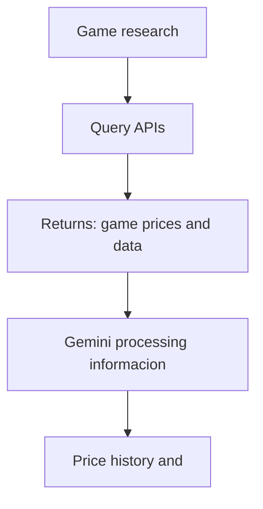

# Ant Fake Promo
--- 

## Sobre o Projeto

---
**Projeto:** 	Monitor de Preços 🛒

**Problema que resolve:** Nosso projeto tem como principal intuíto facilitar a consulta de valores de jogos eletrônicos.

## Integrantes
| Nome | GitHub |
|------|--------|
| Augusto Folva | @Augusto-fp |
| Augustus Klingbeil | @Augustusrossi |
| Kevin Nascimento | @Kevin-nascimento |
| João Victor Teles | @jvictorcarneiro-max |

## Arquitetura

