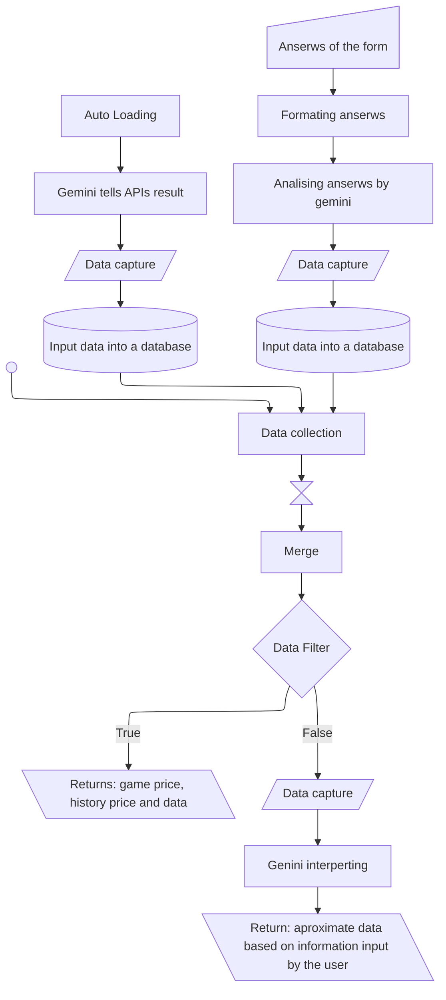

# Ant Fake Promo
--- 

## Sobre o Projeto

---
**Projeto:** 	Monitor de Preços 🛒

**Problema que resolve:** Nosso projeto tem como principal intuíto facilitar a consulta de valores de jogos eletrônicos.

## Integrantes
| Nome | GitHub |
|------|--------|
| Augusto Folva | @Augusto-fp |
| Augustus Klingbeil | @Augustusrossi |
| Kevin Nascimento | @Kevin-nascimento |
| João Victor Teles | @jvictorcarneiro-max |

## Objetivo
Desenvolvimento de uma ferramenta intuitiva e moderna para auxiliar os consumidores de jogos digitais a encontrar as melhores ofertas e verificar (e acompanhar) os preços dos jogos de seu interesse.

## Como funciona:
O projeto foi dividito em três fluxos, a fim de simplificar e melhorar a especificidade de cada um resultando em um foco maior e portanto retornos mais precisos. Sendo eles:

### Fluxo 1:
Planilha de respostas do Forms &rarr; limpeza / formatação das respostas &rarr; Gemini &rarr; planilha com respostas formatadas
**Entrada:**
- Respostas ao formulário

**Processamento:**
- limpeza / formatação das respostas
- Leitura / interpretação do Gemini

**Saída:**
- Planilha com as respostas formatadas

### Fluxo 2:
Entrada automático com timer &rarr; chamada da(s) API(s) &rarr; retorno em um banco de dados (planilha) / dados formatados
**Entrada:**
- Entrada de dados da planilha de respostas do formulário
- Entrada de dados da planilha que simula um banco de dados

**Processamento:**
- Unificação dos dados das tabelas
- Leitura / interpretação do Gemini

**Saída:**
- Filtro das respostas com condições baseadas em informações do "banco de dados"
- Texto com resultado relacionado com o filtro

### Fluxo 3 (base): 
Recebimento dos dados das planilhas (respostas/banco) &rarr; merge &rarr; comparação de filtro:
**Entrada:**
- Entrada de dados pelas APIs usadas

**Processamento:**
- Leitura / interpretação do Gemini

**Saída:**
- Alimentação de uma planilha do Google, simulando um banco de dados

**If true:**
- retorna os jogos

**If false:**
- "jogo não disponível" 
- Gemini -> retorna jogos semelhantes

Há campos de entrada, processamento e saída nos três fluxos.

## Ferramentas Usadas
- N8N
- GitHub
- Gemini
- Mermaid
- APIs:
    - Steam API
    - CheapShark

## Arquitetura

```mermaid
---
config:
  layout: elk
---
flowchart TB
    A["Data collection"] --> B["Merge data"]
    n1["Auto Loading"] --> n2["Gemini tells APIs result"]
    n4["Anserws of the form"] --> n5["Formating anserws"]
    n5 --> n6["Analising anserws by gemini"]
    n7["Start"] --> A
    n2 --> n10["Data capture"]
    n10 --> n3["Input data into a database"]
    n6 --> n11["Data capture"]
    n11 --> n9["Input data into a database"]
    n9 --> A
    n3 --> A
    B --> n12["Merge"]
    n12 --> n15["Data Filter"]
    n15 -- True --> C["Returns: game price, history price and data"]
    n15 -- False --> n16["Data capture"]
    n16 --> n17["Genini interperting"]
    n17 --> n18["Return: aproximate data based on information input by the user"]

    B@{ shape: collate}
    n1@{ shape: rect}
    n4@{ shape: manual-input}
    n7@{ shape: start}
    n10@{ shape: in-out}
    n3@{ shape: db}
    n11@{ shape: in-out}
    n9@{ shape: db}
    n15@{ shape: diam}
    C@{ shape: out-in}
    n16@{ shape: lean-r}
    n18@{ shape: out-in}

```
